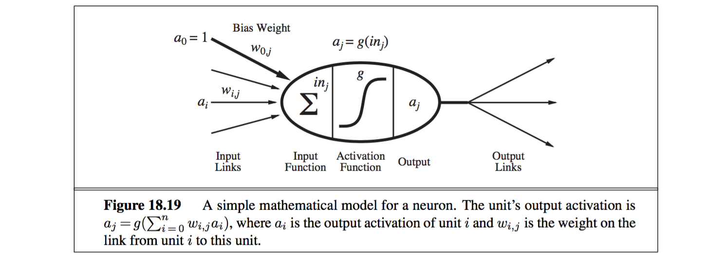

#Artificial Intelligence Methods

## Introduction
- a general introduction to Artificial intellingence. 
- its basis is taken from:
	- mathematics
	- logic
	- cognitive sciences.
- aims at realizing aspects of intelligent behaviour in computer systems.

### Rationality
**Rational Agent**

> A rational agent is an agent that has clear preferences, models uncertainty via expected values of variables or functions of variables, and always chooses to perform the action with the optimal expected outcome for itself from among all feasible actions. [wikipedia](en.wikipedia.org/wiki/Rational_agent)

### Artificial General Intelligence **AGI**

> AGI is the intelligence of a machine that could successfully perform any intellectual task that a human being can. It is a primary goal of artificial intelligence research and an important topic for science ficition writers and futurists. Artificial general intelligence is also referred to as **Strong AI**, **Full AI** or as the ability of a machine to perform "General intelligent action". (wikipedia)

### Philosophical foundations
#### Strong AI vs Weak AI

- Will there be Weak AI ?
	- yes!
- will there be Strong AI ?
	- who cares ?

**Strong AI**

- When AI research first became popular it was desired to create an artificial intelligence that could perform as well, or better than a human brain in every relevant aspect. 
- The early view was that a strong AI had to actually be consicous. Today most AI researchers no longer make that distinction.
- Can be more concisely described as 
	- Can machines really think ?

**Weak AI**

- not actually intelligent, just pretending to be.

## Uncertainty
Chapter 13: Quantifying Uncertainty

> Agents may need to handle uncertainty, whether due to partial obervability, nondeterminism, or a combination of the two.

> An agent may never know for certain what state it's in or where it will end up after a sequence of actions. 

"Uncertainty is everywhere".

### Uncertainty

Let action At = leave for airport t minutes before flight

Relevant question:	Will At get me there on time ?

Problems: 

1. Partial observability
	- road state
	- other driver's plans, etc.
2. Noisy sensors
	- traffic report on radio
3. Uncertainty in action outcomes
	- flat tire, etc
4. Immense complexity of modelling and predicting traffic

### Rational decisions

**Utility theory**

- to represent and reason with preferences. 
- is used in the sense of 'the quality of being useful'.
- every state has a degree of usefulness, or utility, to an angent and that the agent will prefer state with higher utility. 

**Decision Theroy** = **probability** theory + **utility** theory

> The fundamental idea of decision theory is that an agent is rational if and only if it chooses the action that yields the highest expected utility, averaged over all the possible outcomes of the action. This is called the principle of maximum expected utility **MEU**.

### Probability Notation

Sample space

- In probability theory, the set of all possible worlds is called the sample space. 

**Probability model**

- A fully specified probability model associates a numerical probablity P(w) with each possible world.

**Unconditional Probabilities** or Prior probabilities

- They refer to degrees of belief in propositions in the absence of any other information. 

**Conditional Probability** or posterior probability

- P(cavity) = 0.2
- if I am going to dentist because of toothache
	- P(cavity | toothache) = 0.6
		- '|' is pronounced 'given'
		- P(...|...) always means P((...)|(...))
		- means '60% probability of cavity given that toothache is all I know'a

#### Probability
Probabilistic assertions summarize effects of:

- Laziness:	Failure to enumerate exceptions, qualifications, etc.
- Ignorance:	Lack of relevant facts, initial conditions, etc.

**Subjective or Bayesian probability**:

- Probabilities relate propositions to one's own state of knowledge, e.g., P(A15 | no reported accidents) = 0.06
- these are not claims of a 'probabilistic tendency' in the current situation (but might be learned from past experience of similar situations)
- Probabilities of propositions change with new evidence, e.g., P(A15 | no reported accidents, 5 a.m.) = 0.15

**summary**:

- probability is a rigorous formalism for uncertain knowledge
- joint probability distribution specifies probability of every atomic event.
- Queries can be answered by summing over atomic events
- For nontrivial domains, we must find a way to reduce the joint size. 
- Independence and conditional independence provide the tools.

### Indenpendence
Independence also called independence (also marginal independence and absolute independence)

Absolute independence extremely powerful but extremely rare.

**Bayes' rule**

- P(a ∧ b) = P(a | b)P(b) and P(a ∧ b) = P(b | a)P(a)
- P(b | a) = P(a | b)P(b) / P(a)

Conditional independence is the most basic and robust form of knowledge about uncertain environments. 

## Bayesian Networks
> A Bayesian Network is a simple, graphical notation for conditional independence assertion and hence for compact specification of full joint distributions.

> A Bayesian network, Bayes network, belief network, Bayes model or probabilistic directed acyclic graphical model is a probabilistic graphical model ( a type of statistical model ) that represents a set of random variables and their conditional dependecies via a directed acyclic graph (DAG) [wikipedia](https://en.wikipedia.org/wiki/Bayesian_network)

There are two ways to understand the **Semantics of Bayesian networks**:

1. to see the network as a representation of the joint probability distribution.
	- helpful in understanding how to construct networks.
2. to view it as an encoding of a collection of conditional independence statements.
	- Whereas the second is helpful in designing inference procedures.

### Global semantics
Global semantics defines the full joint distribution as the product of the local conditional distributions.

### Phases of the model building process

1. Decide what to model
	- select the boundary for what to include in the model.
2. Defining variables
	- select the important variables in the domain.
3. The qualitative part
	- Define the graphical structure that connects the variables.
4. The quantitative part
	- fix parameters to specify each P(Xi | pa(Xi))
5. Verification 
	- Verification of the model.

**summary**

- **Bayes nets** provide a natural representation for (causally induced) conditional independence
- topology + CPTs = compact representation of joint distribution
- Generally easy to construct - also for non-experts
- Canonical distributions (e.g., noisy-OR) = compact representation of CPTs
- Efficient inference calculations are available (but the god ones are outside the scope of this course).

## probabilistic Reasoning over Time

- Motivation: The world changes; we need to track and predict it.
- Static (Vehicle diagnosis) vs. Dynamic (Diabetes management)
- Basic idea: copy state and evidence variables for each time step 
- Raint = Does it rain at time t. 
	- this assumes discrete time;
	- step size depends on problem 
	- here: Timesteps = Days(?)

### Markov process
> In probability theory and statistics, a Markov process or Markoff process, is a stochastic process that satisfies the Markov property. [wikipedia](https://en.wikipedia.org/wiki/Markov_process)

The transition model specifies the probability distribution over the latest state variables, given the previous values, that is P(Xt | X0:t-1)

**Markov assumption** -- that the current state depends on only a finite fixed number of previous states. Processes satisfying this assumption is called **Markov processes** or **Markov chains**.

**First-order Markov process** -- in which the current state depends only on the previous state and not on any earlier states.

- a state provides enough information to make the future conditionally independent of the past
	- P(Xt | X0:t−1) = P(Xt | Xt−1) 

### Hidden Markov models

- some variables are not observable themselves
- A variable Xt is partially disclosed by the sound signal in frame t. We call the observation Et.

Reasonable assumptions to make:

- Stationary process:
	- Transition model P(Xt | Xt-1) and sensor model P(Xt | Xt) fixed for all t.
- k'th-order Markov process:
	- P(Xt | X0:t-1 ) = P(Xt | Xt-k:t-1 )
- Sensor Markov assumption:
	- P(Et | X1:t, E1:t-1 ) = P(Et | Xt )

### Inference tasks

#### Filtering

- posterior distribution over most **recent state**
- computing the **belief state**
	- input to the decision process of a rational agent.
- also called **state estimation**
- **P(Xt | E1:t )**
	- the probality of rain today, given all the observations of the umbrella carrier made so far.
- Aim: devise a recursive state estimation algorithm:
	- P(Xt+1 | E1:t+1 ) = Some_Func( P(Xt | E1:t), Et+1)
	- = a * P(Et+1 | Xt+1) * P(Xt+1 | E1:t)
		- Evidence: 	P(Et+1 | Xt+1)
		- Prediction:	P(Xt+1 | E1:t)
 		- so, filtering is a predication updated by evidence. 

#### Predication

- Computing posterior distribution over the **future state**, given all evidenc to date.
- Evaluation of possible action sequences; like filtering without the evidence
- **P(Xt+k | E1:t )** k > 0
	- the probability of rain three days from now, given all the observations to date.
	- Predication is useful for evaluating possible courses of action based on their expected outcomes. 

#### Smoothing

- computing posterior distribution over **Past state**, given all evidence up to the present.
- Better estimate of past states
	- Essential for learning 
- **P(Xk | E1:t )**	0 ≦ k < t
	- the probability that it rained at day k (e.g. last Wednesday), given all the observations of the umbrella carrier made up to today.
- Smoothing provides a better estimate of the state than was available at the time, because it incorporates more evidence.

**Forward-Backward**

- The forward-backward algorithm for smoothing:
	- computing posterior probabilities of a sequence of states given a sequence of observations.
- Forward
	- α P(et+1 | Xt+1) sum_xt( P(Xt+1 | xt) P (xt | e1:t) ) (Markov assumption). (15.5)
	- use column vectors to represent the forward and backward messages, all the computations become simple matrix–vector operations:
		- f1:t+1 = α Ot+1 T⊤ f1:t (15.12)
- Backward
	- bk+1:t = T Ok+1 bk+2:t . (15.13)

#### Most likely explanation
Given a sequence of observations, find the sequence of states that is most likely to have generated those observations.

- **P(X1:t | E1:t )**
	- if the umbrella apperas on each of the first three days and is absent on the fourth, 
	- then the most likely explanation is that it rained on the first three days and did not rain on the fourth.

#### Learning
The transition and sensor models, if not yet known, can be learned from observation.

- learning requires smoothing, rather than filtering, because smoothing provides better estimates of the states of the process. 

#### questions:

- What are the assumptions
- Why do we need these assumptions
- What will the model look like
- What inferences can be made

## Rational Agents

## making Complex Decisions

##Learning

### 18 Learning From examples

> An agent is learning if it improves its performance on future tasks after making observations about the world.

Learning agent = Performance element + learning element

**Why would we want an agent to learn**?

1. the designers can not anticipate all possible situations that the agent might find itself in.
2. the designers cannot anticipate all changes over time;
3. sometimes human programmers have no idea how to program a solution themselves.
	- e.g. most people are good at recognizing the faces of family members, but even the best programmers are unable to program a computer to accomplish that task, except by using learning algorithms. 

Any component of an agent can be improved by learning from data. The improvments, and the techniques used to make them, depend on four major factors:
	
1. Which component is to be improved.
2. What prior knowledge the agent already has.
3. What representation is used for the data and the component.
4. What feedback is available to learn from.

Learning method depends on:

- type of performance element
- available feedback
- type of component to be improved
- its representation

**Inductive learning**:		learning a (possible incorrect) general function or rule from specific input-output pairs.

- Simplest form: Learn a function from examples.

**Deductive learning** or **analytical learning**:	going from a known general rule to a new rule that is logically entailed, but is useful because it allows more efficient processing.

**Unsupervised learning**:	the agent learns patterns in the input even though no explicit feedback is supplied.
	
- The most common unsupervised learning task is clustering:
	- detecting potentially useful clusters of input examples.
		- a taxi agent might gradually develop a concept of 'good traffic day' and 'bad traffic day' without ever being given labeled examples of each by a teacher.

**Reinforcement learning**:	The agent learns from a series of reinforcements - rewards or punishments.

- e.g. the lack of a tip at the end of the journey gives the taxi agent an indication that it did something wrong.
- the two points for a win at the end of a chess game tells the agent it did something right. It is up to the agent to decide which of the actions prior to the reinforcement were most responsible for it.
- "Occasional rewards"

**Supervised learning**:	the agent observes some example input - output pairs and learns a function that maps from input to output.

- Decision trees
- Instance-based learning / Case-based reasoning
- Artificial Neural Networks
- "Correct answers for each instance"
- the aim is to find a simple hypothesis approximately consistent with traning examples.

#### Learning Decision Trees

> Decision tree represents a function that takes as input a vector of attribute values and returns a "decision" -- a single output value. The input and output values can be discrete or continuous.

In general, after the first attribute test splits up the examples, each outcome is a new decision tree learning problem in itselft, with fewer examples and one less attribute. There are four cases to consider for these recursive problems:

1. If the remaining examples are all positive (or all negative), then we are done:
	- we can answer Yes or No. 
2. If there are some positive and some negative examples, then choose the best attribute to split them.
3. If there are no examples left, 
	- it means that no example has been observed for this combination of attribute values, 
	- and we return a default value calculated from the plurality classification of all the examples that were used in constructing the node's parent.
	- these are passed along in the variable parent_examples.
4. If there are no attributes left, 
	- but both positive and negative examples,
		- it means that these examples have exactly the same description, but different classifications.
		- This can happen because there is an error or noise in the data;
		- because the domain is nondeterministic;
		- or because we can't observe an attribute that would distinguish the examples.
	- the best we can do is return the plurality classification of the remaining examples.

### Artificial Neural Networks
The base of Deep Learning

artificial neural networks **ANNs** are a family of models inspired by biological neural networks (the central nervous systems of animals, in particular the brain) which are used to estimate or approximate functions that can depend on a large number of inputs and are generally unknown.

- Artificial neural networks are generally presented as systems of interconnected 'neurons' which exchange messages between each other. 
	- the connections have numeric weights that can be tuned based on experience, making neural nets adaptive to inputs and capable of learning.
- other names: 
	- connectionism
	- parallel distributed processing
	- neural computation

The hypothesis that mental activity consists primarily of electrochemical activity in networks of brain cells called neurons.

#### Neural network structures

Neural networks are composed of **nodes** or **units** connected by directed **links**.

- A link from unit i to unit j serves to propagate the **activation** ai from i to j. 
- Each link also has a numeric weight wi,j associated with it, 
	- which determines the strength and sign of the connection.

#### Deep learning
**Deep learning** also known as deep structured learning, hierarchical learning or deep machine learning, is a branch of machine learning based on a set of algorithms that attempt to model high-level abstractions in data by using multiple processing layers, with complex structures or otherwise, composed of multiple non-linear transformations.

## Reinforcenment learning and Robotics

### types of learning

1. **Unsupervised learning**
	- No environmental feedback concerning correctness
	- Learning system detects patterns in the data without attaching right/ wrong status to them.
2. **Supervised Learning**
	- Frequent environmental (e.g. teacher) feedback that includes the correct action / response.
	- Many classic learning algorithms rely on this constant feedback.
3. **Reinforcement Learning**
	- Occasional environmental feedback of form right / wrong or good / bad.
	- Feedback often comes at the end of a long sequence of actions. 

### Reinforcement learning 

- Learning to act in unknown environments with only occasional feedback . 
- Agent learns from its own experience in the environment. 
- RL involves learning the whole problem at once, not via combined sub-problems.
- Balance of exploration -vs- exploitation is key to getting complete information about the environment.

## CBR: Case Based Reasoning

- Case Based Reasoning
	- Case based Problem solving
	- Case based Learning

**CBR** Assumption

- The main assumption is that:
	- Similar problems have similar solutions.
- Two more assumptions:
	- the world is a regular place:
		- what holds true today will probably hold true tomorrow.
	- situations repeat:
		- if they do not, there is no point in remembering them.

**CBR**

- new Case
- **Retrieve**: retrieving similar problems
- retrieved Case / new Case (a new problem, a case without a solution part)
- **Reuse**: copy / adapt Solution form Best Case
- Solved Case: suggestings, suggested solution 
- **Revise**: 
	- Apply new solution to the new problem
	- Success ?
		- yes: go to Retain
		- no:
			- go back to Reuse - or Retrieve
			- unable to solve? ask expert user
- Tested / Repaired Case : Confirmed Solution
- **Retain**
- Learned Cased
- Pasted Cases
	- General Knowledge

**CBR** Strengths:

- It is well suited to many domains
	- where it is difficult to formulate a mathematical model.
- The case base can be said to be similar to human memory.

**CBR** weaknesses:

- Disadvantages include that cases often don't include deeper knowledge of the domain,
- and it is difficult to determine good criteria for indexing and matching cases.

